# Software Analysis and Design

The goal of software architecture is to minimize the human resources required to build and maintain the required system.

Architecture is mainly concerned about three things:

- Function
- Separation of Components
- Data Management

# Table of Contents

- [Software Analysis and Design](#software-analysis-and-design)
- [Table of Contents](#table-of-contents)
- [1. Programming Paradigms](#1-programming-paradigms)
  - [1.1. Structured Programming](#11-structured-programming)
  - [1.2. Object-Oriented Programming](#12-object-oriented-programming)
    - [1.2.1. Encapsulation](#121-encapsulation)
    - [1.2.2. Inheritance](#122-inheritance)
    - [1.2.3. Polymorphism](#123-polymorphism)
  - [1.3. Functional Programming](#13-functional-programming)
- [2. Design Principles: SOLID](#2-design-principles-solid)
  - [2.1. S: Single-Reponsibility Principle (SRP)](#21-s-single-reponsibility-principle-srp)
  - [2.2. O: Open-Closed Principle (OCP)](#22-o-open-closed-principle-ocp)
  - [2.3. L: Liskov Substitution Principle (LSP)](#23-l-liskov-substitution-principle-lsp)
  - [2.4. I: Interface Segregation Principle (ISP)](#24-i-interface-segregation-principle-isp)
  - [2.5. D: Dependency Inversion Principle (DIP)](#25-d-dependency-inversion-principle-dip)
- [3. Component Principles](#3-component-principles)
  - [3.1. Reuse/Release Equivalence Principle (REP)](#31-reuserelease-equivalence-principle-rep)
  - [3.2. Common Closure Principle (CCP)](#32-common-closure-principle-ccp)
  - [3.3. Common Reuse Principle (CRP)](#33-common-reuse-principle-crp)
  - [3.4. The Tension Diagram for Component Cohesion](#34-the-tension-diagram-for-component-cohesion)
  - [3.5. Acyclic Dependencies Principle (ADP)](#35-acyclic-dependencies-principle-adp)
  - [3.6. Stable Dependencies Principle (SDP)](#36-stable-dependencies-principle-sdp)
    - [3.6.1. Stability Metrics](#361-stability-metrics)
  - [3.7. Stable Abstractions Principle (SAP)](#37-stable-abstractions-principle-sap)
    - [3.7.1. Measuring Abstraction](#371-measuring-abstraction)
    - [3.7.2. Measuring Distance from the Main Sequence](#372-measuring-distance-from-the-main-sequence)
- [Relationships between patterns at different levels](#relationships-between-patterns-at-different-levels)
- [Well-designed Architectures](#well-designed-architectures)
  - [Financial Data Summarizer](#financial-data-summarizer)
    - [Separation of Concerns](#separation-of-concerns)
    - [Directional Control](#directional-control)
    - [Information Hiding](#information-hiding)

# 1. Programming Paradigms

Programming paradigms are ways of programming. 
A paradigm tells you which programming structures to use, and when to use them. Each paradigm removes capabilities from
the programmer. They tell us what *not* to do.

> TODO: what about declarative programming?

## 1.1. Structured Programming

Structured programming imposes discipline on direct transfer 
of control. Removes `goto` statements.

Structured programming relies on the Böhm-Jacopini theorem, which states that all programs can be constructed from just 
three structures:

- **Sequence**: execute one subprogram, then another one.
- **Selection**: execute subprograms according to the value of a boolean expression.
- **Iteration**: execute a subprogram as long as a boolean expression is true.

Structured programming allows modules to be recursively decomposed into provable functions. That is, start with a large-scale problem statement and decompose it into high-level functions which can then be decomposed into lower-level functions.

## 1.2. Object-Oriented Programming

Object-oriented programming imposes discipline on indirect transfer of control. Removes function pointers.

Object-oriented programming relies on three concepts: *encapsulation*, *inheritance* and *polymorphism*.

### 1.2.1. Encapsulation

The idea is to draw a line around a cohesive set of data and functions. From outside that line, the data is hidden and only some of the functions are known. This is implemented via public, protected and private members of the class.

### 1.2.2. Inheritance

Inheritance is the mechanism of basing a class upon another class, retaining similar implementation and forming a hierarchy of classes. The child class acquires all the properties and behaviors of the parent class.

### 1.2.3. Polymorphism

Polymorphism is the provision of a single interface to entities of different types.

> TODO: composition, delegation and open recursion

## 1.3. Functional Programming

Functional programming imposes discipline upon assignment. Removes assignment.

Functional programming relies on two concepts:

* **Idempotence**: operations can be applied multiple times without changing the result beyond the initial application.
* **Immutability**: variables do not change, there is no state.

One of the most appealing properties of functional programming is that all race conditions, deadlocks, and concurrent update problems are due to mutable variables. If there are no mutable variables, there are no such problems.

# 2. Design Principles: SOLID

The SOLID principles tell us how to arrange our functions and data structures into classes, and how those classes should be interconnected.

These principles allow us to create mid-level software structures that *tolerate change*, are *easy to understand* and are the *basis of components* that can be used in many software systems.

## 2.1. S: Single-Reponsibility Principle (SRP)

Every module, class or function in a computer program should have responsibility over a single part of that program's functionality, and it should encapsulate that part.

**Symptoms of Violation**

- **Accidental Duplication**: when different actors use the same functionality.
- **Merge Conflicts**: when different features touch the same code and cause conflicts.

## 2.2. O: Open-Closed Principle (OCP)

The behavior of a software artifact should be extendible, without having to modify the artifact.

This principle is one of the driving forces behind the architecture of systems. The goal is to make the system easy to extend without incurring a high impact of change. This is accomplished by partitioning the system into components, and arranging those components into a dependency hierarchy that protects higher-level components from changes in lower-level components.

## 2.3. L: Liskov Substitution Principle (LSP)

This principle states that objects of a superclass shall be replaceable with objects of its subclasses without breaking the application.

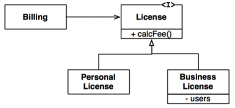

To accomplish this, several rules must be followed:

- **Contravariant inputs parameters in subclass**: input parameters of each method in subtype $S$ must be the same or a *supertype* of the corresponding parameter of the corresponding method in supertype $T$.
- **Covariant outputs in subclass**: outputs of each method in subtype $S$ must be the same or a *subtype* of the corresponding output of the corresponding method in supertype $T$.
- **Covariant exceptions in subclass**: new exceptions cannot be thrown by the methods in the subtype, except if they are the same or a *subtype* of exceptions thrown by the methods of the supertype.
- **Weaker preconditions in subclass**: preconditions (validation on parameters) cannot be made more strict in the subtype.
- **Stronger postconditions in subclass**: postconditions (validation after method execution) cannot be made less strict in the subtype.

The LSP should be extended to the level of architecture. A simple violation of substitutability can cause a system's architecture to be polluted with a significant amount of extra mechanisms.

## 2.4. I: Interface Segregation Principle (ISP)

The ISP dictates that depending on something that carries baggage that you don't need can cause troubles that you didn't expect.

To solve this, you should implement interfaces that contain only the functionality needed by the component.

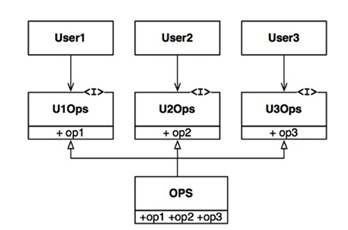

## 2.5. D: Dependency Inversion Principle (DIP)

The DIP tells us that the most flexible systems are those in which source code dependencies refer only to abstractions (interfaces, abstract classes or some other kind of abstract declaration), not to concretions (artifacts in which the functions being called are implemented).

The logic is that changes to concretions rarely require changes to the interfaces they implement, therefore interfaces are less volatile than implementations.

To accomplish this, a few rules must be followed:

- **Don't refer to volatile concrete classes**: refer to abstract interfaces instead. This puts severe constraints on the creation of objects and generally enforces the use of *Abstract Factories*. This implies that you shouldn't derive from volatile concrete classes.
- **Don't override concrete functions**: concrete functions often require source code dependencies. When you override those functions you do not eliminate those dependencies, instead you inherit them. To manage those dependencies, you should make the function abstract and create multiple implementations.

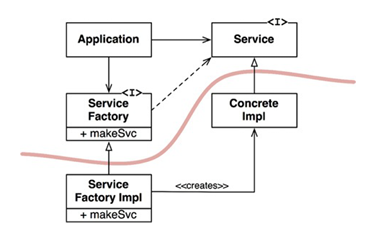

The curved line separates the abstract from the concrete. All source code dependencies cross that curved line pointing in the same direction, toward the abstract side.

The abstract component contains all the high-level business rules of the application. The concrete component contains all the implementation details that those business rules manipulate.

Note that the flow of control crosses the curved line in the opposite direction of the source code dependencies (`Application` depends on `ServiceFactory`, but `ServiceFactoryImpl` depends on `ServiceFactory`). The source code dependencies are inverted against the flow of control, which is why we refer to this principle as Dependency Inversion.

# 3. Component Principles

If the SOLID principles tell us how to arrange the bricks into walls and rooms, then the component principles tell us how to arrange the rooms into buildings. Large software systems are built out of smaller components.

Components are the units of deployment. They are the smallest entities that can be deployed as part of a system. Well-designed components always retain the ability to be independently deployable and, therefore, independently developable.

The component structure cannot be designed from the top-down. It is not one of the first things about the system that is designed (because there is no code to start out with), but rather evolves as the system grows and changes.

Component dependency diagrams have very little to do with describing the function of the application. Instead, they are a map to the *buildability* and *maintainability* of the application. The component dependency graph is created and molded by architects to protect stable high-value components from volatile components.

## 3.1. Reuse/Release Equivalence Principle (REP)

Classes and modules that are formed into a component must belong to a cohesive group. There must be some overarching theme or purpose that those classes and modules all share.

Another way to look at this is that classes and modules that are grouped together in a component should be releasable together.

## 3.2. Common Closure Principle (CCP)

This is the SRP restated for components. Just as the SRP says that a class should not contain multiple reasons to change, the CCP says that a component should not have multiple reasons to change.

The CCP prompts us to gather together in one place all the classes that are likely to change for the same reasons. Thus, when a change in requirements comes along, that change has a good change of being restricted to a minimal number of components.

SRP and CCP can be summarized by:
> Gather together those things that change at the same times and for the same reasons. Separate those things that change at different times or for different reasons.

## 3.3. Common Reuse Principle (CRP)

Classes and modules that tend to be reused together belong in the same component. In such components we would expect to see classes that have lots of dependencies on each other.

The CRP also tells us which classes *not* to keep together in a component. When one component uses another, a dependency is created between the components, even if the *using* component uses only one class within the *used* component. Because of this dependency, changes in the *used* component require changes in the *using* component, along with recompilation, revalidation and redeployment.

Thus, when we depend on a component, we want to make sure we depend on every class in that component. Put another way, we want to make sure that the classes that we put into a component are inseparable - that it is impossible to depend on some and not on the others. Classes that are not tightly bound to each other should not be in the same component.

The CRP is the generic version of the ISP. The ISP advises us not to depend on classes that have methods we don't use. The CRP advises us not to depend on components that have classes we don't use.

ISP and CRP can be summarized by:
> Don't depend on things you don't need.

## 3.4. The Tension Diagram for Component Cohesion

The three cohesion principles tend to fight each other. REP and CCP tend to make components larger, while CRP tends to make components smaller.

The tension diagram below shows the interaction between the cohesion principles. The edges of the diagram describe the cost of abandoning the principle on the opposite vertex.

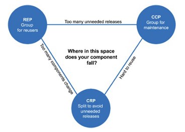

## 3.5. Acyclic Dependencies Principle (ADP)

Ideally, a dependency graph should be fully directed, with no cycles, as shown below:

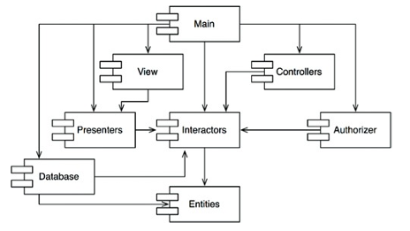

However, in some cases, you could end up with something like this:

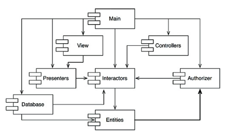

This causes coupling and problems in testing, development and deployment.

It is always possible to break a cycle of components and reinstate the dependency graph as a DAG. There are two primary mechanisms for doing so:

1. Apply the Dependency Inversion Principle by creating an interface.

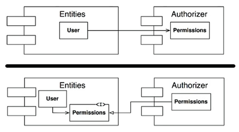

2. Create a new component that both `Entities` and `Authorizer` depend on. Move the classes that they both depend on into that new component.

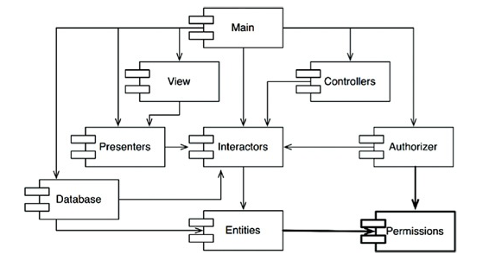

## 3.6. Stable Dependencies Principle (SDP)

This principle states that you should depend in the direction of stability. That is, a given component should depend only on more stable packages.

By conforming to the CCP, we create components that are sensitive to certain kinds of changes but immune to others. Some of these components are *designed* to be volatile. We expect them to change.

A component that is difficult to change should not depend on a component we expect to be volatile. Otherwise, the volatile component will also be difficult to change.

Stability does not refer to the frequency of change, but instead refers to the amount of work required to make a change. This amount of work is directly related to the amount of components that depend on it. A component with lots of incoming dependencies is very stable because it requires a great deal of work to reconcile any changes with all the dependent components.

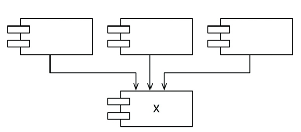

X is stable, since three components depend on it, so it has three good reasons not to change. Conversely, X depends on nothing, so it has no external influence to make it change. We say it is *independent*.

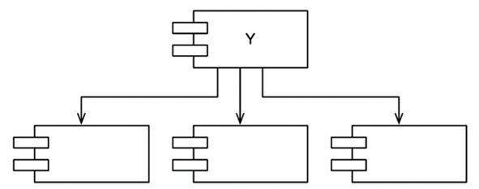

Y is unstable, since no other components depend on it. Also, it has three components that it depends on, so changes may come from three external sources. We say that Y is *dependent*.

### 3.6.1. Stability Metrics

One way to measure the stability of a component is to count the number of dependencies that enter and leave that component.

$$I=\frac{\phi_{\text{out}}}{\phi_{\text{in}}+\phi_{\text{out}}}$$

- $I \in [0, 1]$: instability
- $\phi_{\text{in}}$: number of classes outside this component that depend on classes within the component.
- $\phi_{\text{out}}$: number of classes inside this component that depend on classes outside the component.

The SDP says that the $I$ metric of a component should be larger than the $I$ metrics of the components that it depends on. That is, $I$ metrics should *decrease* in the direction of dependency.

Putting the unstable components at the top of the diagram is a useful convention because any arrow that points *up* is violating the SDP.

To fix SDP violations, we can employ the DIP by creating an interface.

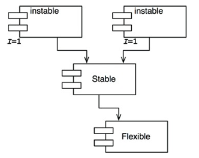

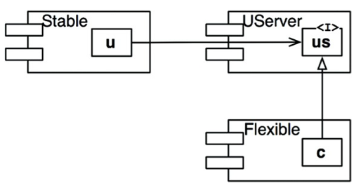

## 3.7. Stable Abstractions Principle (SAP)

This principle states that a component should be as abstract as it is stable.

- Software that encapsulates the high-level business logic and policies of the system should be placed into stable components.
- Software that we want to be able to quickly and easily change should be placed into unstable components.

The SAP sets up a relationship between stability and abstractness. It says that a stable component should also be abstract so that its stability does not prevent it from being extended, and that an unstable component should be concrete since its instability allows the concrete code within it to be easily changed.

### 3.7.1. Measuring Abstraction

$$A=\frac{N_a}{N_c}$$

- $A$: abstractness
- $N_a$: number of abstract classes and interfaces in the component
- $N_c$: number of classes in the component.

Then we can plot $I$ vs $A$:

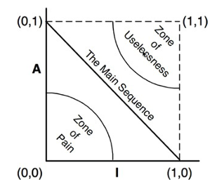

This plot helps determine the zones of exclusion.

- **Zone of pain**: highly stable and concrete component. Undesirable because it is rigid. Cannot be extended because it is not abstract, and is very difficult to change because of its stability. Note that this only applies to volatile components. A nonvolatile component in this region is not really painful at all.
- **Zone of uselessness**: highly abstract, but no dependents. Such components are useless. They are often leftover abstract classes that no one ever implemented.

The most desirable position for a component is at one of the two endpoints of the Main Sequence.

### 3.7.2. Measuring Distance from the Main Sequence

$$D=|A+I-1|$$

Given this metric, a design can be analyzed for its overall conformance to the Main Sequence. Any component that has a $D$ value that is not near zero can be reexamined and restructured.

Statistical analysis can be conducted on this metric too, calculating the mean and variance of $D$ for the components within a design. We would expect a conforming design to have a mean and variance that are close to zero.

Another way to use the metrics is to plot the $D$ metric of each component over time, helping us identify components that are drifting from the Main Sequence.

# Relationships between patterns at different levels

|Property|Class-level|Component-level|Architecture-level|
|---|---|---|---|
|Isolation|Single Reponsibility|Common Closure|Architectural Boundaries|

# Well-designed Architectures

## Financial Data Summarizer

A system that displays a financial summary on a web page. The data on the page is scrollable, and negative numbers are shown in red.

### Separation of Concerns

First we'll apply the SRP to separate the responsibilities into data calculation and data presentation:

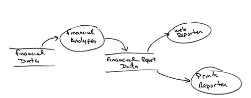

Having made this separation, we need to organize source code dependencies to ensure that changes to one of those responsibilities do not cause changes in the other, and ensure that behavior can be extended without undo modification.

To do this, we partition processes into classes, and group classes into components.

### Directional Control

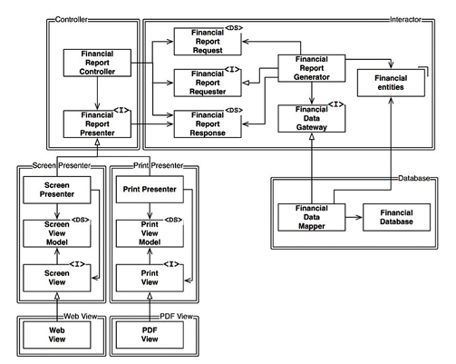

- I: interfaces
- DS: data structures
- Open arrows are *using* relationships
- Closed arrows are *inheritance* relationships

An arrow pointing from class A to class B means that the source code of class A knows about class B, but class B knows nothing about class A.

Component relationships are unidirectional, these arrows point toward the components that we want to protect from change.

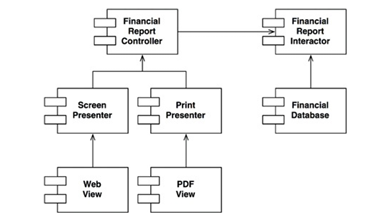

**If component A should be protected from changes in component B, then component B should depend on component A.**

Notice the *Interactor* is protected from everything. This is because this component contains the business rules, the highest-level policies of the application. All other components are dealing with peripheral concerns. 

Even though the *Controller* is peripheral to the *Interactor*, it is nevertheless central to the *Presenters* and *Views*. This creates a hierarchy of protection based on the notion of "level".

This is how the OCP works at the architectural level. Architects separate functionality based on *how*, *why* and *when* it changes, and then organize that separated functionality into a hierarchy of components. Higher-level components are protected from the changes made to lower-level components.

Most of the complexity in the diagram was intended to make sure that the dependencies between the components flow in the correct direction. For example, the `FinancialDataGateway` interface between the `FinancialReportGenerator` and the `FinancialDataMapper` exists to invert the dependency that would otherwise have pointed from the `Interactor` component to the `Database` component.

### Information Hiding

The `FinancialReportRequester` interface exists to protect the `FinancialReportController` from knowing too much about the internals of the `Interactor`. If the interface were not there, then the `Controller` would have transitive dependencies on the `FinancialEntities`.

Transitive dependencies are a violation of the general principle that software entities should not depend on things they don't directly use. So, even though our priority is to protect the `Interactor` from changes to the `Controller`, we also want to protect the `Controller` from changes to the `Interactor` by hiding its internals.