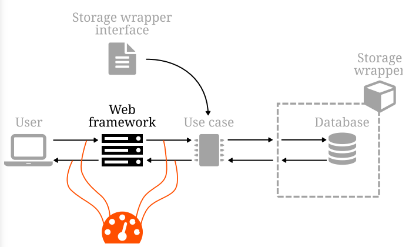

# Clean Software Architecture in Python

**Case Study**:

*Rent-o-Matic* is an application running at https://www.rentomatic.com which provides a room renting system.

Users want to see the available rooms. They open the browser and type de address, then clicking on menus and buttons they reach the page with the list of all the rooms that the company rents.

# 1. System Overview

A clean architecture deals with three primary concerns:

- **Separation of Concerns**: different parts of the system should manage different parts of the process.
- **Abstraction**: a component has a role in the system, regardless of the specific implementation of that component.
- **Inversion of Control**: a technique used to avoid strong coupling between components of a system, that involves wrapping them so that they expose a certain interface. A component expecting that interface can then connect to them without knowing the details of the specific implementation, and thus being coupled to the interface instead of the specific implementation.

Back to our problem. Let's assume that the url for available rooms is `/rooms?status=available`. When the user's browser accesses that URL, an HTTP request reaches our system, where there is a component that is waiting for HTTP connections. Let's call this component "web framework".

The purpose of the web framework is to understand the HTTP request and to retrieve the data we need to provide a response. The framework decodes the request and passes the relevant information to another component that will process. This component is called "use case", and it is the crucial and most important component of the whole system as it implements the *business logic*.

The use case needs to fetch all the rooms that are in an available state, extracting them from a source of data,which is a component we'll call "storage system". Using inversion of control we can wrap the access to the storage system with an interface that exposes a `list_rooms_with_status` method.

Then, data flows back to the user: the wrapper returns the data to the use case, which applies the rest of the business logic and returns the result to the web framework, which returns an HTTP response.

The stages in the process are clearly separated, and this enables two things:

- Easily replaceable components
- Easily testable components

# 2. Components

A good way to increase order and control in a system is to split it into subsystems, establishing clear and rigid borders between them, to regulate the data exchange. This is an extension of the *divide and conquer* concept, which states that it is simpler to rule a set of interconnected small systems than a single complex one.

## 2.1. Data Types

Data Types are the way we encapsulate and transmit information. We need to make sure that types that are shared by different subsystems are known to all of them. The knowledge of data types and formats is, indeed, a form of coupling.

## 2.2. The Four Layers

The clean architecture tries to capture both the *conceptual hierarchy* of components and the *type hierarchy* through a layered approach. Inner layers know nothing about the outer layers.

Communication between layers is guided by a single rule:

> The Golden Rule: talk inwards with simple structures, talk outwards through interfaces.

### 2.2.1. Entities

Entities are representations of domain models, the vocabulary of the business.

This layer will likely contain classes, with methods that simplify the interaction between them. These are different to ORM models, since these entities are not connected with a storage system or presentation layer.

Entities can interact with each other, but they don't know anything that lives in outer layers. They cannot call the database, access methods provided by the presentation framework, or instantiate use cases.

### 2.2.2. Use Cases

Use cases implement the business rules. They should be as small as possible, isolating small actions into separate use cases, as this makes the system easier to test, understand and maintain.

Use cases have full access to the entities layer, so they can instantiate and use them directly. They can also call each other.

### 2.2.3. Gateways

This layer contains components that define interfaces for external systems, that is a common access model to services that do not implement the business rules. For example, this is where the database interface would live.

Gateways have access to entities, so the interface can freely receive and return objects which type has been defined in that layer, as they can freely (although rarely) access use cases.

### 2.2.4. External Systems

This part of the architecture is populated by components that implement the interfaces defined in the previous layer.

External systems have full access to gateways, use cases, and entities.

When we access external systems from a use case (outwards communication) we always need an interface, which is why we wrap the storage with an interface and assume that in the use case.

When the external system wants to call use cases (inwards communication), the code of the endpoint doesn't need any interface to access it.

# 3. Error Management

In a clean architecture, the main process is the creation of use cases and their execution. This is, therefore, the main source of errors, and the use case layer is where we have to implement the error management.

## 3.1. Requests and Responses

We can divide error management code into two different areas.

- **Requests**: the input data that reaches our use case. Requests are objects created from incoming API calls and they shall deal with things like incorrect values, missing parameters, wrong formats and so on.
- **Responses**: the output data returned from the use case. Responses have to contain the actual results of the API calls, but shall also be able to represent error cases and deliver rich information on what happened.

# 4. Unit and Integration Tests

Properly written unit tests should mock any external systems, like the repository or the API. That's why we need integration tests, to raise issues that were masked by mocks.

# 5. Integration with External Systems

The clean architecture forms a very loose coupling between the use cases and the repository, being connected only through the API exposed by the object and not to the real implementation. In other words, the use cases are polymorphic with respect to the method `list`.