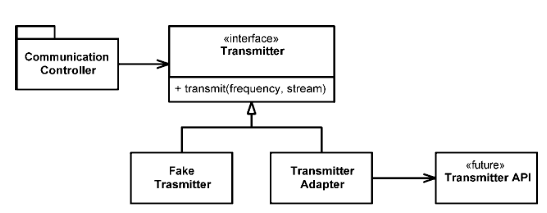

# Clean Code

- [Clean Code](#clean-code)
- [1. Naming](#1-naming)
  - [1.1. Use Intention-Revealing Names](#11-use-intention-revealing-names)
  - [1.2. Avoid Disinformation](#12-avoid-disinformation)
  - [1.3. Make Meaningful Distinctions](#13-make-meaningful-distinctions)
  - [1.4. Use Pronounceable Names](#14-use-pronounceable-names)
  - [1.5. Use Searchable Names](#15-use-searchable-names)
  - [1.6. Class Names](#16-class-names)
  - [1.7. Method Names](#17-method-names)
  - [1.8. Pick One Word per Concept](#18-pick-one-word-per-concept)
  - [1.9. Pick One Word per Purpose](#19-pick-one-word-per-purpose)
  - [1.10. Use Solution Domain Names](#110-use-solution-domain-names)
  - [1.10. Use Problem Domain Names](#110-use-problem-domain-names)
  - [1.11. Add Meaningful Context](#111-add-meaningful-context)
- [2. Functions](#2-functions)
  - [2.1. Functions Should Be Small](#21-functions-should-be-small)
  - [2.2. Functions Should Do One Thing](#22-functions-should-do-one-thing)
  - [2.3. One Level of Abstraction per Function](#23-one-level-of-abstraction-per-function)
  - [2.4. Functions Must be Readable Top-to-Bottom](#24-functions-must-be-readable-top-to-bottom)
  - [2.5. Switch Statements](#25-switch-statements)
  - [2.6. Use Descriptive Names](#26-use-descriptive-names)
  - [2.7. Few Arguments](#27-few-arguments)
  - [2.8. Functions Should Have No Side Effects](#28-functions-should-have-no-side-effects)
  - [2.9. Command Query Separation](#29-command-query-separation)
  - [2.10. Error Handling](#210-error-handling)
- [3. Comments](#3-comments)
  - [3.1. Comments Do Not Make Up for Bad Code](#31-comments-do-not-make-up-for-bad-code)
  - [3.2. Good Comments](#32-good-comments)
    - [3.2.1. Legal Comments](#321-legal-comments)
    - [3.2.2. Explanation of Intent](#322-explanation-of-intent)
    - [3.2.3. Warning of Consequences](#323-warning-of-consequences)
    - [3.2.4. TODO Comments](#324-todo-comments)
  - [3.3. Bad Comments](#33-bad-comments)
    - [3.3.1. Redundant Comments](#331-redundant-comments)
    - [3.3.2. Mandated Comments](#332-mandated-comments)
    - [3.3.3. Commented-Out Code](#333-commented-out-code)
- [4. Formatting](#4-formatting)
  - [4.1. Vertical Formatting](#41-vertical-formatting)
    - [4.1.1. The Newspaper Metaphor](#411-the-newspaper-metaphor)
    - [4.1.2. Vertical Openness Between Concepts](#412-vertical-openness-between-concepts)
    - [4.1.3. Vertical Density](#413-vertical-density)
    - [4.1.4. Vertical Distance](#414-vertical-distance)
    - [4.1.5. Variable Declarations](#415-variable-declarations)
    - [4.1.6. Dependent Functions](#416-dependent-functions)
    - [4.1.7. Conceptual Affinity](#417-conceptual-affinity)
  - [4.2. Horizontal Formatting](#42-horizontal-formatting)
    - [4.2.1. Horizontal Openness and Density](#421-horizontal-openness-and-density)
  - [4.3. Conventions](#43-conventions)
- [5. Objects and Data Structures](#5-objects-and-data-structures)
  - [5.1. The Law of Demeter](#51-the-law-of-demeter)
  - [5.2. Hybrid Structures](#52-hybrid-structures)
  - [5.3. Data Transfer Objects](#53-data-transfer-objects)
  - [5.4. Active Records](#54-active-records)
- [6. Error Handling](#6-error-handling)
  - [6.1. Provide Context with Exceptions](#61-provide-context-with-exceptions)
  - [6.2. Define Exception Classes in Terms of a Caller's Needs](#62-define-exception-classes-in-terms-of-a-callers-needs)
  - [6.3. Don't Return Null](#63-dont-return-null)
    - [6.3.1. Special Case Pattern](#631-special-case-pattern)
- [7. Boundaries](#7-boundaries)
  - [7.1. Using Third-Party Code](#71-using-third-party-code)
  - [7.2. Using Code That Does Not Yet Exist](#72-using-code-that-does-not-yet-exist)
- [8. Unit Tests](#8-unit-tests)
  - [8.1. The Three Laws of Test-Driven Development](#81-the-three-laws-of-test-driven-development)
  - [8.2. Keeping Tests Clean](#82-keeping-tests-clean)
  - [8.3. Single Concept per Test](#83-single-concept-per-test)
  - [8.4. F.I.R.S.T.](#84-first)
- [9. Classes](#9-classes)
  - [9.1. Class Organization](#91-class-organization)
  - [9.2. Classes Should Be Small](#92-classes-should-be-small)
    - [9.2.1. The Single Responsibility Principle](#921-the-single-responsibility-principle)
    - [9.2.2. Cohesion](#922-cohesion)
    - [9.3. Isolation from Change](#93-isolation-from-change)
- [10. Smells and Heuristics](#10-smells-and-heuristics)
  - [10.1. Comments](#101-comments)
    - [C1: Code Change Metadata](#c1-code-change-metadata)
    - [C2: Obsolete Comments](#c2-obsolete-comments)
    - [C3: Redundant Comments](#c3-redundant-comments)
    - [C4: Commented-out Code](#c4-commented-out-code)
  - [10.2. Environment](#102-environment)
    - [E1: Multi-step Build](#e1-multi-step-build)
    - [E2: Multi-step Tests](#e2-multi-step-tests)
  - [10.3. Functions](#103-functions)
    - [F1: Too Many Arguments](#f1-too-many-arguments)
    - [F2: Mutation of Input Arguments](#f2-mutation-of-input-arguments)
    - [F3: Flag Arguments](#f3-flag-arguments)
    - [F4: Dead Functions](#f4-dead-functions)
  - [10.4. General](#104-general)
    - [G1: Multiple Languages in One Source File](#g1-multiple-languages-in-one-source-file)
    - [G2: Failure to Test Boundary Conditions](#g2-failure-to-test-boundary-conditions)
    - [G3: Duplicate Code](#g3-duplicate-code)
    - [G4: Code at Wrong Level of Abstraction](#g4-code-at-wrong-level-of-abstraction)
    - [G5: Too Much Information](#g5-too-much-information)
    - [G6: Dead Code](#g6-dead-code)
    - [G7: Vertical Separation](#g7-vertical-separation)
    - [G8: Inconsistency](#g8-inconsistency)
    - [G9: Clutter](#g9-clutter)
    - [G10: Artificial Coupling](#g10-artificial-coupling)
    - [G11: Feature Envy](#g11-feature-envy)
    - [G12: Selector Arguments](#g12-selector-arguments)
    - [G13: Misplaced Responsibility](#g13-misplaced-responsibility)
    - [G14: Inappropriate Static Methods](#g14-inappropriate-static-methods)
    - [G15: Function Names Should Say What They Do](#g15-function-names-should-say-what-they-do)
    - [G16: Be Precise](#g16-be-precise)
    - [G17: Encapsulate Conditionals](#g17-encapsulate-conditionals)
    - [G18: Negative Conditionals](#g18-negative-conditionals)
    - [G19: Hidden Temporal Couplings](#g19-hidden-temporal-couplings)
    - [G20: Don't Be Arbitrary](#g20-dont-be-arbitrary)
    - [G21: Keep Configurable Data at High Levels](#g21-keep-configurable-data-at-high-levels)
    - [G22: Avoid Transitive Navigation](#g22-avoid-transitive-navigation)
  - [10.5. Names](#105-names)
    - [N1: Choose Descriptive Names](#n1-choose-descriptive-names)
    - [N2: Choose Names at the Appropriate Level of Abstraction](#n2-choose-names-at-the-appropriate-level-of-abstraction)
    - [N3: Use Standard Nomenclature Where Possible](#n3-use-standard-nomenclature-where-possible)
  - [10.6. Tests](#106-tests)
    - [T1: Insufficient Tests](#t1-insufficient-tests)
    - [T2: Ignored Tests](#t2-ignored-tests)
    - [T3: Test Boundary Conditions](#t3-test-boundary-conditions)
    - [T4: Bugs Tend to Congregate](#t4-bugs-tend-to-congregate)

# 1. Naming

## 1.1. Use Intention-Revealing Names

The name of a variable, function, or class, should tell you **why it exists**, **what it does**, and **how it is used**. If a name requires a comment, then the name does not reveal its intent.

```python
days_since_creation: int
get_flagged_cells() -> List[Cell]
```

## 1.2. Avoid Disinformation

Avoid words whose meanings vary from our intended meaning.

- Do not refer to a grouping of accounts as `account_list` unless it's actually a `List`.
- Avoid using names which vary in small ways. Ex: `ABCThisIsMySuperClass` and `ABCThisIsMySubClass`

## 1.3. Make Meaningful Distinctions

Noise words are redundant, and can lead to confusion and misuse.

- `variable` should never appear in a variable name.
- `table` should never appear in a table name.
- `moneyAmount` is indistinguishable from `money`, or `customerInfo` from `customer`

## 1.4. Use Pronounceable Names

- Avoid naming conventions such as `DtaRcrd102` or `pszqint`

## 1.5. Use Searchable Names

Single-letter names and numeric constants are difficult to locate across a body of text.

Single-letter names should ONLY be used as local variables inside short methods.

## 1.6. Class Names

Classes and objects should have noun on noun phrase names like `Customer`, `WikiPage`, `Account` and `AddressParser`. A class name should not be a verb.

## 1.7. Method Names

- Methods should have verb or verb phrase names like `post_payment`, `delete_page` or `save`.
- Accessors, Mutators and Predicates should be named for their value and prefixed with `get`, `set`, and `is`, respectively.
- When constructors are overloaded, use static factory methods with names that describe the arguments. Ex: `DataFrame.from_records()`

## 1.8. Pick One Word per Concept

For each abstract concept, pick a word and stick with it.

- `fetch`, `retrieve` and `get` all mean the same abstract concept. Pick only one. Same thing with `controller`, `manager` and `driver`.

## 1.9. Pick One Word per Purpose

Related to the last point, avoid using the same word for different purposes.

- If `add` deals with adding or concatenating numbers, avoid using `add` to append items to a list. Use `append` or `insert` instead.

## 1.10. Use Solution Domain Names

When applicable, use computer science terms, algorithm names, pattern names, math terms and so forth.

- `AccountVisitor` for a `Visitor` pattern implementation
- `JobQueue` for a `queue` that stores jobs.

## 1.10. Use Problem Domain Names

When applicable, use problem domain names. The code that has more to do with problem domain concepts should have names drawn from the problem domain.

## 1.11. Add Meaningful Context

For a variable like `state`, context is often necessary to answer the question: "the state of *what*?".

Context can be added by prefixing, like `user_state`, or even better by creating a `User` class with a `state` attribute.

# 2. Functions

Remember that the reason we write functions is to decompose a larger concept into a set of steps at the next level of abstraction.

## 2.1. Functions Should Be Small

- Functions should rarely be over 20 lines long.
- Functions should be transparently obvious.
- Functions should tell a story.
- Each function should lead you to the next in a compelling order.
- Blocks within `if`, `else` and `while` statements should be one line long. Probably that line should be a function call.
- Functions should not be large enough to hold nested structures. Therefore, the indent level of a function should not be greater than one or two.

```python
def render_page_with_setups_and_teardowns(page_data, is_suite):
    if is_test_page(page_data):
        include_setup_and_teardown_pages(page_data, is_suite)
    return page_data.get_html()
```

## 2.2. Functions Should Do One Thing

If the function does only those steps that are one level of abstraction below the stated name of the function, then the function is doing one thing.

We can see this by expressing the purpose of the above function:

> To *RenderPageWithSetupsAndTeardowns*, we check to see whether the page *is a test page* and if so, we *include the setups and teardowns*. In either case we *render the page in HTML*.

Another way to know that a function is doing more than one thing is if you can extract another function from it with a name that is not merely a restatement of its implementation. For example, if we redefine the function above as:

```python
def render_page_with_setups_and_teardowns(page_data, is_suite):
    include_setup_and_teardown_pages_if_test_page(page_data, is_suite)
    return page_data.get_html()
```

we're merely restating the `if` block.

## 2.3. One Level of Abstraction per Function

We need to make sure that the statements within our function are all at the same level of abstraction. Avoid mixing concepts of different levels of abstraction.

- High level: `get_html()`
- Intermediate level: `page_path_name = PathParser.render(page_path)`
- Low level: `.append("\n")`

Mixing levels of abstraction within functions is always confusing. Readers may not be able to tell whether a particular expression is an essential concept or a detail.

## 2.4. Functions Must be Readable Top-to-Bottom

We want the code to read like a top-down narrative. We want every function to be followed by those at the next level of abstract so that we can read the program, descending one level of abstraction at a time as we read down the list of functions.

```
To include the setups and teardowns, we include setups, then we include the test page content, and then we include the teardowns.

    To include the setups, we include the suite setup if this is a suite, then we include the regular setup. 

    To include the suite setup, we search the parent hierarchy for the “SuiteSetUp” page and add an include statement with the path of that page.
    
    To search the parent...
```

## 2.5. Switch Statements

Switch statements are tricky. By their very nature they do *N* things.

The general solution when using `switch` statements is to bury them in the basement of an `Abstract Factory`, and never let anyone see it. The factory will use the `switch` statement to create appropriate instances of the classes and functions it is meant to create.

## 2.6. Use Descriptive Names

- A long descriptive name is better than a short enigmatic name with a long descriptive documentation.
- Be consistent in your names. Use the same phrases, nouns, and verbs in the function names you choose for your modules. Ex: `includeSetupPages` and `includeSuiteSetupPage`

## 2.7. Few Arguments

Functions should have as few arguments as possible. Triadic (three-argument) functions should be avoided where possible.

- Monadic forms are valid in functions like `file_exists` or `open_file`
- Flag arguments are bad practices. It complicates the signature of the method and proclaims that the function does more than one thing. It does one thing if the flag is true, and another if the flag is false.
- Dyadic functions are harder to understand than monadic functions. But they can often be converted into monadic functions by making them methods of a `class` that takes the other argument in its constructor.
- Triadic functions are significantly harder to understand than dyads. Usually, this means that some of those arguments should be wrapped into a class of their own and the object should be passed instead.

```python
# dyadic function
writeField(output_stream, name)

# convert to monadic function
output_stream = OutputStream(stream)
output_stream.writeField(name)
```

```python
# triadic function
make_circle(x, y, radius)

# convert to diadic function
center = Point(x, y)
make_circle(center, radius)
```

## 2.8. Functions Should Have No Side Effects

Side effects are lies. Your function promises to do one thing, but it also does other *hidden* things. This can cause strange temporal couplings and order dependencies.

Watch out for unexpected changes to the variables of its own class, passed parameters, or system globals. If your function must change the state of something, have it change the state of its owning object. In other words, make it a method of the class.

## 2.9. Command Query Separation

Functions should either do something or answer something, but not both.

Either your function should change the state of the object, or it should return some information about the object.

## 2.10. Error Handling

Functions should do one thing. Error handling is one thing. Thus, a function that handles errors should do nothing else.

This implies that if the keyword `try` exists in a function, it should be the very first word in the function and that there should be nothing after the `catch/finally` blocks. Extract everything else into happy-path functions.

# 3. Comments

Comments are a necessary evil. Well-placed comments are helpful, dogmatic comments clutter up modules and inaccurate comments are extremely damaging. Comments are used to compensate for our failure to express ourselves in codes.

## 3.1. Comments Do Not Make Up for Bad Code

When you find yourself in a position where you need to write a comment, think it through and see if there is a way to express yourself in code.

```python
# check to see if the employee is eligible for full benefits
if employee.flags and HOURLY_FLAG and employee.age > 65:
    ...

# rewritten to make the code expressive
if employee.is_eligible_for_full_benefits():
    ...
```

## 3.2. Good Comments

Some comments are necessary or beneficial.

### 3.2.1. Legal Comments

Copyright and authorship statements.

```python
# LEGAL: Copyright (C) 2003,2004,2005 by Object Mentor, Inc. All rights reserved.
# Released under the terms of the GNU General Public License version 2 or later.
```

### 3.2.2. Explanation of Intent

Comments that provide the intent behind a decision.

```python
# INTENT: Stricter offers are ranked higher because there is less competition for them.
```

### 3.2.3. Warning of Consequences

Used to amplify the importance of something that may otherwise seem inconsequential.

```python
# WARNING: Test case disabled because it takes a long time
# WARNING: Casting to float8 is required to avoid excessive memory consumption.
```

### 3.2.4. TODO Comments

To-Do notes are used to explain why the function has a degenerate implementation, or when a better solution can be implemented in the future.

```python
# TODO: Wrap the logic with a decorator
```

## 3.3. Bad Comments

Usually they are excuses for poor code or justifications for insufficient decisions, amounting to little more than the programmer talking to himself.

### 3.3.1. Redundant Comments

Comments that say exactly the same as the code.

```python
# the processor delay for this component
background_processor_delay = -1
```

### 3.3.2. Mandated Comments

Not every function must have a docstring, and not every variable must have a comment. Comments are technical debt, they need to be maintained and can create the potential for lies and misdirection.

```python
def add_CD(title: str, author: str):
    """
    Adds a new CD

    Args:
        title [str]: the title of the CD
        author [str]: the author of the CD
    """
    ...
```

### 3.3.3. Commented-Out Code

Simply raises the question: "why are those lines of code commented out?" - Are they important? Were they left as reminders for some imminent change? Or are they just garbage that no one ever cleaned up?

Even if you need them, source control will take care of that. Don't leave commented-out code.

# 4. Formatting

Formatting is important, it's about communication, which is the professional developer's first order of business.

## 4.1. Vertical Formatting

Small files are easier to understand than large files. Ideally, files should be between 200 and 500 lines long.

### 4.1.1. The Newspaper Metaphor

Source code files should be like a newspaper article.

- The name should be simple but explanatory, and by itself should be sufficient to tell us whether we are in the right module or not.
- The topmost parts of the source file should provide the high-level concepts and algorithms. Detail should increase as we move downward, until at the end we find the lowest level functions and details.

### 4.1.2. Vertical Openness Between Concepts

Vertical openness separates concepts. Blank lines should separate the package declaration, the imports, and each of the functions.

```python
import pandas as pd

class StringFormatter:

    def __init__():
        ...

    def format():
        ...
```

```python
import pandas as pd

class StringFormatter:
    def __init__():
        ...
    def format():
        ...
```

### 4.1.3. Vertical Density

Vertical density implies close association. So lines of code that are tightly related should appear vertically dense. Avoid breaking this density with useless comments.

```python
class ReporterConfig:

    # the class name of the reporter listener
    reporter_listener_class_name = 'EventListener'

    # the properties of the reporter listener
    listener_properties = []

    def add_property(self, property: Property):
        self.listener_properties.append(property)
```

```python
class ReporterConfig:

    reporter_listener_class_name = 'EventListener'
    listener_properties = []

    def add_property(self, property: Property):
        self.listener_properties.append(property)
```

### 4.1.4. Vertical Distance

Concepts that are closely related should be kept vertically close to each other, avoiding jumping up and down through the source file just to understand what the system does.

### 4.1.5. Variable Declarations

Variables should be declared as close to their usage as possible.

- Control variables for loops should usually be declared within the loop statement.
- Instance variables should be declared at the top of the class, or in the constructor. In well-designed classes they are used by many, if not all, of the methods of the class.

### 4.1.6. Dependent Functions

If one function calls another, they should be vertically close, and the caller should be above the callee. This gives the program a natural flow. Readers should be able to trust that function definitions will follow shortly after their use.

This is closely related to the idea of functions only dealing with one level of abstraction and having lower-level functions at the bottom. With well-designed functions, this flow should be natural.

### 4.1.7. Conceptual Affinity

Strong conceptual affinity should have small vertical distance. For example, `validation` functions, or `assertion` functions should be packed together in the same vertical space.

## 4.2. Horizontal Formatting

The Hollerith limit says the maximum line length should be 80 characters, but you could stretch it out to up to 120 characters.

### 4.2.1. Horizontal Openness and Density

We use horizontal whitespace to associate things that are strongly related and disassociate things that are more weakly related.

- Assignment operators should have whitespace around them.
- No whitespace between the function name and the opening parenthesis.
- Function arguments separated with a whitespace after the comma.

```python
a = b + c
return determinant(a, b, c)
```

## 4.3. Conventions

When working in a team, set up a collection of conventions to follow. The objective is to make the software have a consistent style. We don't want it to appear to have been written by a bunch of disagreeing individuals. These conventions include:

- Indent size
- Class naming
- Variable naming
- Method naming

# 5. Objects and Data Structures

There is a fundamental difference between objects and data structures. Objects hide their data behind abstractions and expose functions that operate on that data. Data structures expose their data and have no meaningful functions.

```python
# procedural

class Rectangle:
    height: float
    width: float

class Circle:
    center: Point
    radius: float
    
class Geometry:
    PI = 3.14159

    def area(self, shape):
        if isinstance(shape, Rectangle):
            return shape.height * shape.width
        elif isinstance(shape, Circle):
            return self.PI * shape.radius * shape.radius
```

```python
# object-oriented

class Rectangle:
    height: float
    width: float

    def area(self):
        return self.height * self.width

class Circle:
    PI = 3.14159

    center: Point
    radius: float

    def area(self):
        return self.PI * self.radius * self.radius
```

This exposes the fundamental dichotomy between objects and data structures:

- Procedural code (code using data structures) makes it easy to add new functions without changing the existing data strcutures, but makes it hard to add new data structures because all the functions must change.
- Object-oriented code makes it easy to add new classes without changing existing functions, but makes it hard to add new functions because all the classes must change.

If you want the flexibility to add new data types, use object-oriented. If you want the flexibility to add new behaviors, use procedural.

## 5.1. The Law of Demeter

The *Law of Demeter* says that a module should not know about the innards of the *objects* it manipulates.

Objects should hide their data and expose operations. This means that an object should not expose its internal structure through accessors because to do so is to expose, rather than to hide, its internal structure.

More precisely, the Law of Demeter says that a method $f$ of a class $C$ should only call the methods of these:

- $C$
- An object created by $f$
- An object passed as an argument to $f$
- An object held in an instance variable of $C$

The methods should *not* invoke methods on objects that are returned by any of the allowed functions. In other words, talk to friends, not to strangers.

## 5.2. Hybrid Structures

Hybrid structures are classes that are half object and half data structure. They have functions that do significant things, and they also have either public variables or public accessors and mutators that make private variables public.

Such hybrids make it hard to add new functions but also make it hard to add new data structures. They are the worst of both worlds.

## 5.3. Data Transfer Objects

Data Transfer Objects (DTOs) are the quintessential form of a data structure. A DTO is a class with public variables and no functions.

DTOs are very useful, especially when communicating with databases or parsing messages from sockets. They often become the first in a series of translation stages that convert raw data in a database into objects in the application code.

```python
# example of a DTO
@dataclass
class Address:
    street: str
    city: str
    state: str
    zip_code: str
```

## 5.4. Active Records

Active Records are special forms of DTOs. They are data structures with public variables, but they typically have navigational methods like `save` and `find`. Typically these Active Records are direct translations from database tables, or other data sources.

Unfortunately, some developers treat these data structures as objects by putting business rule methods in them. This creates the undesirable Hybrid Structures.

The solution is to treat the Active Record as a data structure and to create separate objects that contain the business rules that hide their internal data (which are probably just instances of the Active Record).

# 6. Error Handling

Error handling is important. Things can go wrong, and when they do, we are responsible for making sure that our code does what it needs to do. However, error handling should not obscure logic.

## 6.1. Provide Context with Exceptions

Each exception that you throw should provide enough context to determine the source and location of an error.

Create informative messages and pass them along with your exceptions. Mention the operation that failed and the type of failure.

## 6.2. Define Exception Classes in Terms of a Caller's Needs

When we define exception classes in an application, our most important concern should be *how they are caught*.

A best practice is to create wrappers around third-party APIs, so that you define error codes that capture multiple third-party exceptions and contain useful messages tailored to your application.

## 6.3. Don't Return Null

Returning `null` usually ends up with `NullPointerException` somewhere in the code.

If you are tempted to return `null` from a method (whether internal or third-party), consider throwing an exception or returning a **Special Case** object instead.

### 6.3.1. Special Case Pattern

The Special Case Pattern creates a class or configures an object so that it handles a special case for you. When you do, the client code doesn't have to deal with exceptional behavior. That behavior is encapsulated in the special case object.

# 7. Boundaries

We rarely control all the software in our systems. Sometimes we buy third-party packages or use open source. Other times we depend on teams in our own company to produce components or subsystems for us. Somehow we must cleanly integrate this foreign code with our own.

Change happens at boundaries. Good software designs accommodate change without huge investments and rework. When we use code that is out of our control, special care must be taken to protect ourselves.

Code at the boundaries needs clear separation and tests that define expectations. We should avoid letting too much of our code know about the third-party particulars.

We manage third-party boundaries by having very few places in the code that refer to them. We may wrap them, or use an `Adapter` to convert from our perfect interface to the provided interface.

## 7.1. Using Third-Party Code

Third-party code usually has a very broad interface with plenty of capabilities. This power and flexibility is useful, but it can also be a liability.

Passing this third-party code around the application causes coupling between many parts of the application and the third-party code.

A clean way to use third-party code is to wrap it in a class and expose the methods required by the application, handling exceptions and validation rules inside this class. This also has the added benefit that if something within the third-party code changes, the impact to our application is contained to this class.

It's also useful to create unit tests for the third-party code, to make sure that it does what we expect it to do.

## 7.2. Using Code That Does Not Yet Exist

Sometimes you need to start working on code that depends on other code that hasn't even been defined yet (not even its interface).

In this case, the solution is the `Adapter` pattern. Create a class with the interface you *wished* the future implementation had, work with it, and then when the real implementation comes in the future you write an adapter to the interface you had defined.



# 8. Unit Tests

## 8.1. The Three Laws of Test-Driven Development

Following the laws of TDD pretty much guarantees that you have tests that will cover virtually all of our production code, and while this is desirable, it also comes with a large maintenance problem.

1. You may not write production code until you have written a failing unit test.
2. You may not write more of a unit test than is sufficient to fail, and not compiling is failing.
3. You may not write more production code than is sufficient to pass the currently failing test.

## 8.2. Keeping Tests Clean

Having dirty tests is equivalent to, if not worse than, having no tests. The problem is that tests must change as the production code evolves. The dirtier the tests, the harder they are to change.

*Test code is just as important as production code*. It requires thought, design, and care. It must be kept as clean as production code.

Unit tests keep our code flexible, maintainable and reusable. If you have tests, you do not fear making changes to the code.

The main thing that makes a unit test *clean* is **readability.** Clarity, simplicity and density of expression is what makes code readable.

Tests should follow the `Build-Operate-Check` pattern: *build* the test data, *operate* on the test data, *check* that the operation yielded the expected result.

## 8.3. Single Concept per Test

We want to test a single concept in each test function. We don't want long test functions that go testing one miscellaneous thing after another.

## 8.4. F.I.R.S.T.

Clean tests follow five other rules that form the F.I.R.S.T. acronym:

- **Fast**: tests should run quickly. Otherwise you are disencouraged to run them and won't feel as free to change the code.
- **Independent**: one test should not set up the conditions for the next test. You should be able to run each test independently and in any order you like. Otherwise a failed test causes downstream ones to fail, making diagnosis difficult.
- **Repeatable**: tests should be repeatable in any environment. Otherwise you won't be able to run the tests when the environment isn't available.
- **Self-Validating**: tests should have a boolean output. Either they pass or fail. Otherwise tests would require long manual validations.
- **Timely**: tests should be written just before the production code that makes them pass. Otherwise you might find the production code to be hard to test and avoid building tests for it.

# 9. Classes

## 9.1. Class Organization

1. Public class constants
2. Private class variables
3. Private instance variables

## 9.2. Classes Should Be Small

Size in classes doesn't refer to the number of lines, but to the number of *responsibilities*.

The name of the class should describe what responsibilities it fulfills. If you cannot derive a concise name for a class, then it's likely too large.

As a guideline, you should be able to write a brief description of the class in less than 25 words without using the words *if*, *and*, *or* or *but*.

### 9.2.1. The Single Responsibility Principle

Classes should have one, and only one, *reason to change*. Classes should have one responsibility - one reason to change.

### 9.2.2. Cohesion

Classes should have a small number of instance variables. Each of the methods of a class should manipulate one or more of those variables. In general, the more variables a method manipulates the more cohesive that method is to its class.

### 9.3. Isolation from Change

If a class depends upon another class, make it depend on an interface to that class instead of the concrete class.

This minimizes coupling and adheres to the Dependency Inversion Principle, which says that our classes should depend upon abstractions, not on concrete details.

# 10. Smells and Heuristics

## 10.1. Comments

### C1: Code Change Metadata

Change histories, authors, last-modified date and so on should not appear in comments. Leave this to the source control systems.

### C2: Obsolete Comments

Comments that are old, irrelevant and incorrect. It is best not to write a comment that will become obsolete. If you find one, update it or delete it.

### C3: Redundant Comments

Comments that say something that is explicit in the code. Remove them.

### C4: Commented-out Code

Commented-out code is an abomination. Delete it.

## 10.2. Environment

### E1: Multi-step Build

Building a project should be a single command.

### E2: Multi-step Tests

Running unit tests should be a single command.

## 10.3. Functions

### F1: Too Many Arguments

Functions should have a small number of arguments. More than three is very questionable and should be avoided.

### F2: Mutation of Input Arguments

If your functio must change the state of something, have it change the state of the object it is called on.

### F3: Flag Arguments

Boolean arguments loudly declare that the function does more than one thing, breaking the SRP.

### F4: Dead Functions

Methods and functions that are never called should be deleted.

## 10.4. General

### G1: Multiple Languages in One Source File

A single source file should contain only one language.

### G2: Failure to Test Boundary Conditions

Look for every boundary condition and write a test for it.

### G3: Duplicate Code

DRY: Don't Repeat Yourself. Every duplicated code is a missed opportunity for abstraction. That duplication could probably become a function or class.

### G4: Code at Wrong Level of Abstraction

Base classes should have all the high-level details. Derivatives should have the low-level details. Same applies to source files, modules and components.

### G5: Too Much Information

Well-defined modules should have very small interfaces that allow you to do a lot with very little. Hide your data, hide your utility functions, hide your constants and your temporaries.

### G6: Dead Code

Code that isn't executed.

- `if` statements that check for conditions that can never happen.
- `catch` blocks of a `try` that never `throws`.
- Utility methods that are never called.
- `switch/case` conditions that never occur.

### G7: Vertical Separation

- Variables and functions should be defined close to where they are used.
- Local variables should be declared just above their first usage and should have a small vertical scope.
- Private functions should be defined just below their first usage. Finding a private function should just be a matter of scanning downward from the first usage.

### G8: Inconsistency

Principle of least surprise. If you do something a certain way, do all similar things in the same way. Stick to the conventions you use.

### G9: Clutter

- Remove default constructors with no implementation.
- Remove variables that aren't used.
- Remove functions that are never used.
- Remove comments that add no information.

### G10: Artificial Coupling

Things that don't depend upon each other should not be artificially coupled. For example, general `enums` should not be contained within more specific classes because this forces the whole application to know about these more specific classes. The same goes for general purpose `static` functions being declared in specific classes.

### G11: Feature Envy

The methods of a class should be interested in the variables and functions of the class they belong to, and not the variables and functions of other classes.

The smell is when a method uses accessors and mutators of some other object to manipulate the data within that object. It *envies* the scope of the class of the other object.

### G12: Selector Arguments

Selector arguments are arguments that are used to select the behavior of the function. This directly breaks the principle that a function should do only one thing.

It is better to have many functions than to pass some code into a function to select the behavior.

### G13: Misplaced Responsibility

Code should go where the reader expects it to go.

### G14: Inappropriate Static Methods

If a method has a chance to behave polymorphically, it should not be static.

### G15: Function Names Should Say What They Do

If you have to look at the implementation (or documentation) of a function to know what it does, then you should find a better name or arrange functionality so that it can be placed in functions with better names. For example, what is the function `date.add(5)` supposed to do?

### G16: Be Precise

When you make a decision in your code, make sure you make it precisely. Ambiguity and imprecision in code are either a result of disagreement or laziness.

- If you query for what you think is the only record in the database, make sure your code checks to be sure there aren't others.
- If you need to deal with currency, use integers and deal with rounding appropriately.
- If there is the possibility of concurrent update, make sure you implement some kind of locking mechanism.
- If you decide to call a function that might return `null`, make sure you check for `null`.

### G17: Encapsulate Conditionals

Boolean logic is hard enough to understand without having to see it in the context of an `if` or `while` statement. Extract functions that explain the intent of the conditional.

### G18: Negative Conditionals

Negatives are harder to understand than positives. When possible, conditionals should be expressed as positives.

### G19: Hidden Temporal Couplings

Temporal coupling is when a function must be called before another one.

To solve this, expose the temporal coupling by creating a bucket brigade. Each function produces a result that the next function needs, so there is no reasonable way to call them out of order.

### G20: Don't Be Arbitrary

Have a reason for the way you structure your code, and make sure that reason is communicated by the structure of the code. If a structure appears arbitrary, others will feel empowered to change it. If a structure appears consistently throughout the system, others will use it and preserve the convention.

### G21: Keep Configurable Data at High Levels

If you have constants such as a default or configuration value that is known and expected at a high level of abstraction, do not bury it in a lower-level function. Expose it as an argument to that low-level function called from the high-level function.

The lower levels of the application do not own the values of these constants.

### G22: Avoid Transitive Navigation

If `A` collaborates with `B`, and `B` collaborates with `C`, we don't want modules that use `A` to know about `C`.

We want our immediate collaborators to offer all the services we need, otherwise the architecture becomes rigid and difficult to change.

## 10.5. Names

### N1: Choose Descriptive Names

Names in software are 90% of what makes software readable. Choose them wisely and keep them relevant.

### N2: Choose Names at the Appropriate Level of Abstraction

Don't pick names that communicate implementation; choose names that reflect the level of abstraction of the class or function you are working in.

### N3: Use Standard Nomenclature Where Possible

Follow design patterns conventions if using one, or commonly-used names in the language, like `to_string()` instead of `convert_to_string()`

## 10.6. Tests

### T1: Insufficient Tests

A test suite should test everything that could possibly break. Use coverage tools for this.

### T2: Ignored Tests

Sometimes we are uncertain about a behavioral detail because the requirements are unclear, and we reflect this on missing or ignored tests.

### T3: Test Boundary Conditions

We often get the middle of an algorithm right, but misjudge the boundaries.

### T4: Bugs Tend to Congregate

When you find a bug in a function, it is wise to do an exhaustive test of that function. You'll probably find that the bug was not alone.


#todo: rewrite

the strategy of keeping functions small and keeping parameter lists short can sometimes lead to instance variables being used only by a subset of methods. When this happens, it almost always means that there is at least one other class trying to get out of the larger classes. You should try to separate the variables and methods into two or more classes such that the new classes are more cohesive.