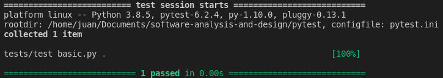

# Python Testing with `pytest`

# 1. Introduction

## 1.1. Naming Convention

By default, the naming conventions to keep your test code discoverable by pytest are:

- Test files should be named `test_*.py` or `*_test.py`
- Test methods and functions should be named `test_*`
- Test classes should be named `Test*`

## 1.2. pytest Output

To run tests, the syntax format is:

`pytest [options] [file_or_dir] [file_or_dir] [...]`



The output contains some useful information:

### `===== test session starts =====`

Shows the start of the test session. A *session* is one invocation of pytest, including all of the tests run on possibly multiple directories.

### `rootdir: /path, configfile: pytest.ini`

The `rootdir` is the topmost common directory to all of the directories being searched for test code.

The `configfile` lists the configuration file being used. They can be `pytest.ini`, `tox.ini`, or `setup.cfg`.

### `collected x items`

Shows the number of test functions detected.

### `tests/test_basic.py .`

Shows each file being tested.

- `.` test passed
- `F` test failed
- `E` test raised error
- `s` test skipped
- `x` test xfails
- `X` test xpasses

---

## 1.3. Running a Single Test, TestClass or TestClass method

To run just one test:

```bash
pytest tests/test_file.py::my_test
```

To run just one test class:

```bash
pytest tests/test_file.py::MyTestClass
```

To run just one test class method:

```bash
pytest tests/test_file.py::MyTestClass::my_test_method
```

## 1.4. Common Options

- `-k EXPRESSION`: only run tests which match the given substring expression.
- `-m MARKEXPR`: only run tests matching give mark expression.
- `-x, --exitfirst`: exit instantly on first error or failed test.
- `-v, --verbose`: increase verbosity.
- `-q, --quiet`: decrease verbosity.
- `--durations=N`: show `N` slowest setup/test durations (N=0 for all).
- `--collect-only`: only collects tests, don't execute them.
- `-s, --capture=no` allows print statements to be printed to `stdout` while the tests are running. Without this flag, the output is captured, but in failing tests the output will be reported.
- `-r` shows extra test summary info. Can be useful to show the reasons for skipping tests, and other test outcomes.
- `-l, --showlocals`: prints out the local variables in a failing test.
- `-tb=style`: modifies the way tracebacks for failures are output. May be one of `short`, `line` and `no`.
- `--setup-show`: shows when fixtures are setup and tore down, with their respective scope (`F` for function scope, `S` for session scope).

# 2. Writing Test Functions

A normal python package structure with tests is shown below:

```
project/
    src/
        tasks/
            __init__.py
            api.py
            tasks.py
    tests/
        conftest.py
        pytest.ini
        unit
            __init__.py
            test_tasks.py
        integration
            __init__.py
            test_api.py
        functional
            __init__.py
            test_func.py
    setup.py
```

The `setup.py` file directs `pip` to install the package. It can be installed as `pip install .`

Notice the separation between `unit` and `functional` tests. Functional tests should not break during refactoring or implementation changes, but unit tests most likely will.

The `pytest.ini` file is optional. It contains project-wide pytest configuration. There should be at most only one of these in your project.

The `conftest.py` file is also optional. It is considered by pytest as a "local plugin" and can contain hook functions and fixtures. You can have multiple `conftest.py` files.

Tests are defined by `assert` statements.

## 2.1. Expecting Exceptions

```python
def test_raises():
    with pytest.raises(TypeError):
        ...
```

You can also check to make sure the exception message is correct by adding `as excinfo`:

```python
def test_raises():
    with pytest.raises(TypeError) as excinfo:
        ...
    exception_message = excinfo.value.args[0]
    assert exception_message == "Invalid parameter"
```

The `excinfo` variable contains information about the exception and is of type `ExceptionInfo`.

## 2.2. Marking

You can mark functions to represent specific subsets of tests. For example, you can mark some functions to perform a quick smoke test.

```python
@pytest.mark.smoke
def test_something():
    ...
```

To run tests with the specific `smoke` mark:

```bash
pytest -m 'smoke'
```

A test can have more than one marker, and a marker can be on multiple tests.

The expression after `-m` can use `and`, `or` and `not` to combine multiple markers:

```bash
pytest -m 'smoke and not api'
```

## 2.3. Skipping Tests

pytest also includes a few helpful builtin markers: `skip`, `skipif`, and `xfail`.

To mark tests that should be skipped:

```python
@pytest.mark.skip(reason="misunderstood the API")
def test_something():
    ...
```

To mark tests that should be conditionally skipped (for example, depending on the package version):

```python
@pytest.mark.skipif(tasks.__version__ < '0.2.0', reason='not supported until v0.2.0')
def test_something():
    ...
```

The `xfail` marker can be used to tell pytest to run a test function, but that we expect it to fail.

```python
@pytest.mark.xfail(tasks.__version__ < '0.2.0')
def test_something():
    ...
```

In the output, `x` means "expected to fail", while `X` means "expected to fail but passed".

## 2.4. Parametrized Testing

Parametrized testing is a way to send multiple sets of data through the same test and have pytest report if any of the sets failed.

The first argument to `parametrize()` is a string with a comma-separated list of names. The second argument is a list of values.

```python
@pytest.mark.parametrize(
    "a,b",
    [
        (1, 2),
        (2, 3),
        (3, 4)
    ]
)
def test_something():
    ...
```

# 3. Fixtures

Fixtures refer to the mechanism pytest provides to allow the separation of *setup* and *teardown* code from your test functions.

Fixtures are essential to structuring test code for almost any non-trivial software system. Fixtures are functions that are run by pytest before (and sometimes after) the actual test functions. The code in the fixture can do whatever you want it to. You can use fixtures to get a data set for the tests to work on. You can use fixtures to get a system into a known state before running a test.

The `@pytest.fixture` decorator is used to tell pytest that a function is a fixture. When you include the fixture name in the parameter list of a test function, pytest knows to run it before running the test; pytest will look in the module of the test for a fixture of that name, and if it doesn't find it then it will look in `conftest.py` files.

Additionally, fixtures can also be used as parameters to other fixtures.

```python
@pytest.fixture()
def my_fixture():
    return 42

def test_my_fixture(my_fixture):
    assert my_fixture == 42
```

## 3.1. Sharing Fixtures Through `conftest.py`

You can put fixtures into individual test files, but to share fixtures among multiple test files, you need to use a `conftest.py` file somewhere centrally located for all of the tests that should use that fixture.

## 3.2. Using Fixtures for Setup and Teardown

Some fixtures (like database operations) need *setup* and *teardown*.

```python
@pytest.fixture()
def database():
    # setup
    db.connect()

    yield

    # teardown
    db.disconnect()
```

In order to communicate the purpose of each test you can use the GIVEN/WHEN/THEN format for a test:

```python
def test_add_returns_valid_id(database):
    # GIVEN an initialized database
    # WHEN a new task is added
    # THEN returned task_id is of type int
    new_task = Task("do something")
    task_id = tasks.add(new_task)
    assert isinstance(task_id, int)
```

## 3.3. Specifying Fixture Scope

Fixtures include an optional parameter called `scope`, which controls how often a fixture gets set up and torn down. The `scope` parameter can be one of:

- `'function'`: run once per test function. This is the default scope.
- `'class'`: run once per test class, regardless of how many test methods are in the class.
- `'module'`: run once per module, regardless of how many test functions, methods or fixtures in the module use it.
- `'session'`: run once per session. All test methods and functions using a fixture of session scope share one setup and teardown call.

The scope is set at the definition of a fixture, and not at the place where it's called. The test functions that use a fixture don't control how often a fixture is set up and torn down.

Fixtures can only depend on other fixtures of their same scope or wider. So a function scope fixture can depend on other function scope fixtures, or on class, module and session scope fixtures, but you can't go in the reverse order.

## 3.4. Specifying Fixtures with `usefixtures`

You can mark a class with `@pytest.mark.usefixtures('fixture1', 'fixture2')`.

Using `usefixtures` is almost the same as specifying the fixture name in the test method parameter list. The difference is that the test can use the return value of a fixture only if it's specified in the parameter list. **A test using a fixture due to** `usefixtures` **cannot use the fixture's return value.**

## 3.5. Using `autouse` for Fixtures that Always Get Used

So far, all of the fixtures used by tests were named by the tests. However, you can use `autouse=True` to get a fixture to run all of the time. This works well for code you want to run at certain times, but tests don't really depend on any system state or data from the fixture.

Common use cases for this is to report the time it takes to run a function or module.

```python
@pytest.fixture(autouse=True)
def report_duration(scope="module"):
    start = time.time()
    yield
    stop = time.time()
    print(f"\n\t duration: {stop - start} seconds")
```

and then run the test suite as:

```bash
pytest -v -s
```

## 3.6. Parametrizing Fixtures

With parametrized fixtures, every test function that uses that fixture will be called once per parameter of the fixture.

This can be useful to test the system works with different databases.

```python
@pytest.fixture(params=['a', 'b'])
def my_fixture(request):
    param = request.param
    ...
```